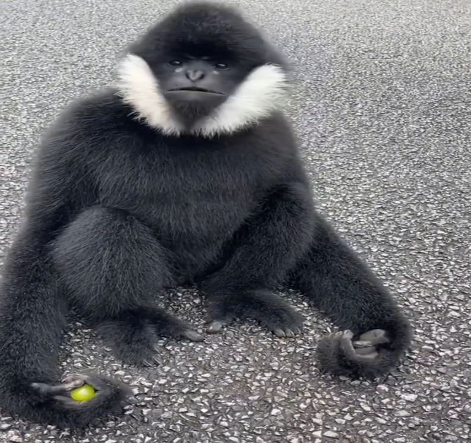

```
▀████▄     ▄███▀ ▄▄█▀▀██▄ ▀███▄   ▀███▀████▀ ▀███▀▀███▀▀▀███▀████▀  ▀████▀▀     ██      ▄█▀▀▀█▄█████▀  ▀████▀▀
  ████    ████ ▄██▀    ▀██▄ ███▄    █   ██   ▄█▀    ██    ▀█  ██      ██       ▄██▄    ▄██    ▀█ ██      ██   
  █ ██   ▄█ ██ ██▀      ▀██ █ ███   █   ██ ▄█▀      ██   █    ██      ██      ▄█▀██▄   ▀███▄     ██      ██   
  █  ██  █▀ ██ ██        ██ █  ▀██▄ █   █████▄      ██████    ██████████     ▄█  ▀██     ▀█████▄ ██████████   
  █  ██▄█▀  ██ ██▄      ▄██ █   ▀██▄█   ██  ███     ██   █  ▄ ██      ██     ████████  ▄     ▀██ ██      ██   
  █  ▀██▀   ██ ▀██▄    ▄██▀ █     ███   ██   ▀██▄   ██     ▄█ ██      ██    █▀      ██ ██     ██ ██      ██   
▄███▄ ▀▀  ▄████▄ ▀▀████▀▀ ▄███▄    ██ ▄████▄   ███▄██████████████▄  ▄████▄▄███▄   ▄████▄▀█████▀▄████▄  ▄████▄▄
```
The only hasher you'll ever need!

TL;DR: Uses a downscaled version of this image as hashing constants.

Yeah that's about it - wouldn't recommend anyone to use this seriously. 🐒

## Examples
```
"monkey was here"  -> cc8cea1a7d080ee01ca26699113672ed
"Monkey was here"  -> cc8cca1a7d082ee00fea669811367157
"monkey was here " -> cc8cea1c7d08120e1ca2669a11367484
"monkey was HERE"  -> ca890b0a16840fa01ca239a960006e69
```